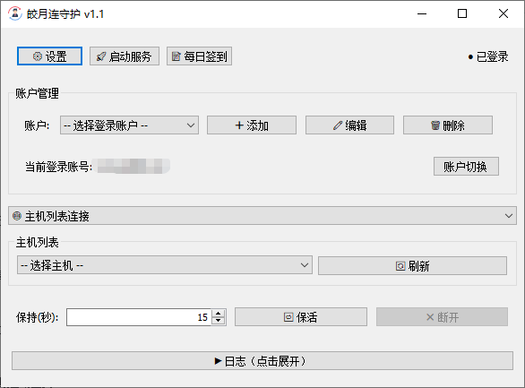

# 皎月连守护 v1.1

> 远程连接管理客户端，提供自动连接、保活、多账户管理等功能

[MIT License](LICENSE)

## 技术栈

| 类别 | 说明 |
|------|------|
| **语言** | Go 1.26 |
| **目标平台** | Windows（原生 Win32 API） |
| **GUI 框架** | [lxn/walk](https://github.com/lxn/walk) — Windows 原生窗口/控件框架（基于 Win32 API） |

### 核心依赖

| 包名 | 版本 | 用途 |
|------|------|------|
| `github.com/gorilla/websocket` | v1.5.3 | WebSocket 客户端，负责与服务端通信 |
| `github.com/lxn/walk` | v0.0.0-20210112085537 | Windows GUI 框架，创建原生窗口和控件 |
| `github.com/lxn/win` | v0.0.0-20210218163916 | Windows API 封装，用于托盘图标、DPI 设置等 |
| `github.com/getlantern/systray` | v1.2.2 | 系统托盘图标支持 |

### 间接依赖

| 包名 | 用途 |
|------|------|
| `github.com/getlantern/context` | 上下文管理 |
| `github.com/getlantern/errors` | 错误处理工具 |
| `github.com/getlantern/golog` | 日志库 |
| `github.com/getlantern/hex` | 十六进制编解码 |
| `github.com/getlantern/hidden` | 隐藏服务端相关 |
| `github.com/getlantern/ops` | 操作工具 |
| `github.com/go-stack/stack` | 调用栈工具 |
| `github.com/oxtoacart/bpool` | 缓冲区池 |
| `golang.org/x/sys` | Go 系统调用扩展 |
| `gopkg.in/Knetic/govaluate.v3` | 表达式求值 |

## 项目结构

```
GoWork/
├── main.go              # 程序入口，初始化 DPI 感知和公共控件
├── go.mod               # Go 模块定义
├── config.json          # 运行时配置文件（账户、服务器地址等）
│
├── config/              # 配置管理
│   └── config.go        # 配置加载/保存，账户结构定义
│
├── protocol/            # 通信协议
│   └── message.go       # WebSocket 消息格式定义与解析
│
├── wsclient/            # WebSocket 客户端
│   └── client.go        # WebSocket 连接、收发、心跳管理
│
├── ui/                  # 用户界面
│   ├── app.go           # 主窗口、业务逻辑、状态管理
│   ├── state.go         # 应用状态结构定义
│   ├── keepalive.go     # 保活定时器管理
│   ├── settings_dialog.go  # 设置对话框
│   ├── account_dialog.go   # 账户添加/编辑对话框
│   ├── icon_loader.go      # 图标加载工具
│   └── embed_icon.go       # 嵌入式图标数据
│
├── sign/                # 签到功能
│   └── sign.go          # 官网签到 HTTP 请求
│
├── winres/              # Windows 资源文件
│   ├── icon.ico         # 应用图标
│   ├── icon16.png       # 小图标
│   └── winres.json      # 资源配置
│
└── .gitignore           # Git 忽略规则
```

## 程序逻辑

### 核心流程

```
启动 → 初始化 DPI/控件 → 加载配置 → 创建主窗口 → 自动登录 → 连接服务端 → 保活循环
```

### 各模块职责

#### 1. `main.go` — 入口
- 调用 `SetProcessDPIAware` 解决 Windows 高 DPI 显示问题
- 调用 `FreeConsole` 隐藏控制台窗口
- 初始化公共控件（用于进度条等）
- 加载配置并启动 UI

#### 2. `config/` — 配置管理
- `Config` 结构体存储所有设置：服务器地址、EXE 路径、账户列表、保活间隔
- `Account` 结构体存储单个账户：用户名、密码、上次使用的识别码/密码
- `Load()` 从 `config.json` 读取配置，文件不存在则返回默认值
- `Save()` 原子写入（先写 `.tmp` 再重命名），防止意外中断导致配置损坏

#### 3. `protocol/` — 通信协议
消息格式：`类型<$!$>字段1<$!$>字段2...`

| 消息类型 | 说明 |
|---------|------|
| `login` | 登录请求（用户名、密码、是否保存密码、是否自动登录）|
| `pclist` | 请求在线主机列表 |
| `pcinfo` | 请求指定主机详情 |
| `conpc` | 连接指定主机 |
| `concode` | 通过识别码连接 |
| `stopcon` | 断开当前连接 |
| `exit` | 退出登录（用于热切换）|

服务器响应类型：`start`、`0`（失败）、`1`/`2`（成功）、`pclist`、`pcinfo`、`conpc`、`conerr`、`discon`、`vipend` 等。

#### 4. `wsclient/` — WebSocket 客户端
- 基于 `gorilla/websocket` 封装
- 自动 ping/pong 心跳（10 秒间隔）
- 60 秒读超时检测死连接
- 事件回调：`EventConnected`、`EventDisconnected`、`EventMessage`
- 线程安全的 `Send()` 方法

#### 5. `ui/` — 用户界面
- **app.go**: 主窗口定义、所有业务逻辑（登录、连接、保活、账户切换、签到）
- **state.go**: 状态结构体，跟踪连接状态、登录状态、保活状态
- **keepalive.go**: 定时器管理，周期性执行连接检查
- **settings_dialog.go**: 设置对话框（服务器地址、EXE 路径）
- **account_dialog.go**: 账户添加/编辑对话框

#### 6. `sign/` — 签到功能
- 模拟浏览器登录 `natpierce.cn`
- 先检查是否需要签到（`PreCheck`），再执行签到（`Sign`）
- 支持批量签到所有账户

## 功能简介

皎月连守护是一款远程连接管理客户端，主要功能：

- **自动连接**：启动后自动登录并连接服务端
- **两种连接方式**：主机列表连接 / 识别码连接
- **自动保活**：定期检查连接状态，断线自动重连
- **多账户管理**：添加、编辑、删除、热切换账户
- **自动签到**：服务到期时自动为所有账户执行官网签到
- **后台运行**：关闭窗口后最小化到系统托盘继续运行

---

## 界面说明

### 顶部工具栏

| 按钮 | 功能 |
|---|---|
| ⚙️ 设置 | 配置服务端地址和 EXE 路径 |
| 🚀 启动服务 | 启动 EXE 进程并连接服务端 |
| 📝 签到 | 为所有已保存账户执行官网签到 |

### 状态显示（右上角）

| 显示 | 含义 |
|---|---|
| ● 未启动（灰色） | 程序未启动 |
| ● 已连接（绿色） | WebSocket 已连接，等待登录 |
| ● 已登录（绿色） | 登录成功 |
| ● 已连接（紫色） | 已连接到目标主机/识别码 |
| ● 已断开（灰色） | 连接断开，3 秒后自动重连 |
| ● 切换中（橙色） | 账户切换进行中 |

### 账户管理

| 控件 | 功能 |
|---|---|
| 账户下拉框 | 选择已保存的账户 |
| ➕ 添加 | 添加新账户（用户名 + 密码） |
| ✏️ 编辑 | 修改选中账户 |
| 🗑️ 删除 | 删除选中账户 |
| 当前登录账号 | 显示当前已登录的账户名 |
| 账户切换 | 切换到下拉框选中的账户（会先停止保活） |

### 连接方式

| 模式 | 说明 |
|---|---|
| 🌐 主机列表连接 | 从在线主机列表中选择主机连接 |
| 🔑 识别码连接 | 输入 8 位识别码和连接密码 |

### 保活控制

| 控件 | 功能 |
|---|---|
| 保持(秒) | 保活检查间隔（默认 60 秒） |
| 🔁 保活 | 启动/停止保活模式 |
| ❌ 断开 | 手动断开当前连接 |

---

## 使用步骤

### 首次使用

1. 双击运行 `GoWork.exe`
2. 点击 **⚙️ 设置**，填写服务端地址（默认 `ws://127.0.0.1:33272/ws`），可选配置 EXE 路径
3. 点击 **➕ 添加**，输入账户用户名和密码
4. 点击 **🚀 启动服务**

### 日常使用

1. 启动程序后自动登录上次使用的账户
2. 选择连接方式：
   - 主机列表连接：从下拉框选择目标主机
   - 识别码连接：输入 8 位识别码和连接密码
3. 点击 **🔁 保活** 开启自动维持连接
4. 程序会自动处理断线重连，无需手动干预

### 切换账户

1. 在账户下拉框选择目标账户
2. 点击 **账户切换**
3. 确认后自动切换（会先停止保活，切换后需手动重新开启保活）

### 签到

- 手动：点击 **📝 签到**，程序会为所有已保存账户执行官网签到
- 自动：服务到期时程序会自动触发所有账户签到

### 后台运行与退出

| 操作 | 结果 |
|---|---|
| 点击窗口关闭按钮 | 最小化到系统托盘（不退出） |
| 双击托盘图标 | 恢复主窗口 |
| 右键托盘 → 显示主界面 | 恢复主窗口 |
| 右键托盘 → 退出软件 | 彻底退出程序 |

---

## 日志查看

- 点击 **▶ 日志（点击展开）** 查看运行日志
- 日志显示连接状态、登录结果、签到结果等信息
- 日志最多保留 50 条，超出自动裁剪

---



## 常见问题

**Q：启动后显示"连接失败"**
A：请检查服务端地址是否正确，以及服务端是否已启动运行。

**Q：连接后自动断开**
A：这是正常现象，程序会在 3 秒后自动重连。如果持续断开，请检查网络连接。

**Q：保活模式下如何切换账户？**
A：点击"账户切换"会自动停止保活，切换完成后需手动重新开启保活。

**Q：签到功能有什么用？**
A：签到可以延长服务使用时间。程序支持手动签到和到期自动签到。

**Q：程序关闭后还会保持连接吗？**
A：点击关闭按钮只会最小化到托盘，连接会保持。只有右键托盘选择"退出软件"才会彻底退出。

**Q：识别码和密码会自动保存吗？**
A：是的，每个账户最后使用的识别码和连接密码会自动保存，下次选择该账户时自动加载。

**Q：如何彻底退出程序？**
A：右键系统托盘图标，选择"退出软件"。

---

## 许可证

本项目采用 [MIT 许可证](LICENSE) 开源。
